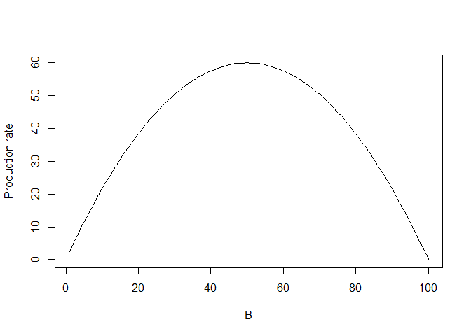
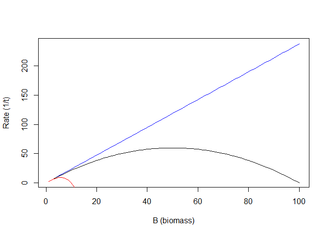
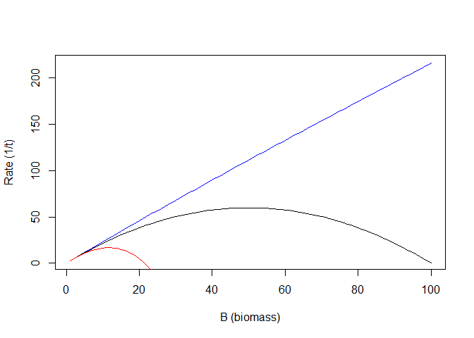
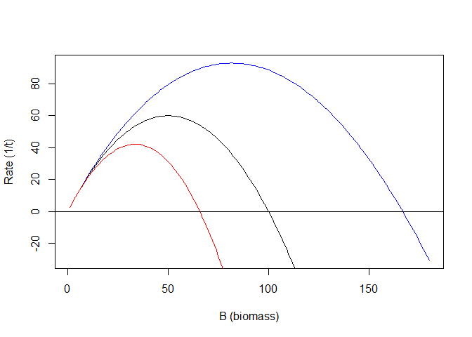

Pella Tomlinson *m* exploraiton
================

*I’ll use Q&D and H&W as shorthand for Quinn & Deriso 1999 and Hilborn &
Walters 1992*

Copy over the Fletcher from production-models.Rmd  
Fletcher’s formulation is used in subsequent development because of the
inherent utility of its parameters (Quinn & Deriso).

``` r
fletcher <- function(B, Binf, m) {
  (4 * m) / Binf * (1 - B / Binf) * B
}
B <- 1:100
plot(B, type = "l", sapply(1:100, function(x) fletcher(x, 100, 60)), ylab = "Production rate")
```

<!-- -->

*How does this m relate to Pella-Tomlinson in Hilborn and Walters (1992)
Eq. 8.4.4?*  
\*\*m\* in Q&D is sub notation meaning maximum, but also units? See Eq
2.5 and following text.  
\*If *m* = 60 in the equation above, and Q&D call this the maximum, why
is the peak at 50?

Now the Pella-Tomlinson independent of catch. With *m* = 2 so it should
look like above.

``` r
PelTom <- function(B, r, k, m) {
  (r*B) - ((r/k)*B^m)
}
Pdot <- sapply(B, function(x) PelTom(x, r = 2.4, k = 100, m = 2)) #same B as above
plot(B, Pdot, type = "l", ylim = c(-10, max(Pdot)), ylab = "Rate (1/t)", xlab = "B (biomass)")
```

<!-- -->

How does changing *m* affect this shape of productivity?

``` r
Pdotm1 <- sapply(B, function(x) PelTom(x, r = 2.4, k = 100, m = 1)) #same B as above
Pdotm2 <- sapply(B, function(x) PelTom(x, r = 2.4, k = 100, m = 2)) #same B as above
Pdotm3 <- sapply(B, function(x) PelTom(x, r = 2.4, k = 100, m = 3)) #same B as above

plot(Pdotm1, type = "l", ylab = "Rate (1/t)", xlab = "B (biomass)", col = "blue")
lines(B, Pdotm2, col = "black")
lines(B, Pdotm3, col = "red")
```

<!-- -->

Try again with more realistic m??

``` r
Pdotm1 <- sapply(B, function(x) PelTom(x, r = 2.4, k = 100, m = 1.5)) #same B as above
Pdotm2 <- sapply(B, function(x) PelTom(x, r = 2.4, k = 100, m = 2)) #same B as above
Pdotm3 <- sapply(B, function(x) PelTom(x, r = 2.4, k = 100, m = 2.5)) #same B as above

plot(Pdotm1, type = "l", ylab = "Rate (1/t)", xlab = "B (biomass)", col = "blue")
lines(B, Pdotm2, col = "black")
lines(B, Pdotm3, col = "red")
```

<!-- -->

Almost looks the same but look at the red line!  
Try again with different values.

``` r
B <- 1:180 #adjust range of biomass so we can see more

Pdotm1 <- sapply(B, function(x) PelTom(x, r = 2.4, k = 100, m = 1.9)) #same B as above
Pdotm2 <- sapply(B, function(x) PelTom(x, r = 2.4, k = 100, m = 2)) #same B as above
Pdotm3 <- sapply(B, function(x) PelTom(x, r = 2.4, k = 100, m = 2.1)) #same B as above

plot(Pdotm1, type = "l", ylab = "Rate (1/t)", xlab = "B (biomass)", col = "blue")
lines(B, Pdotm2, col = "black")
lines(B, Pdotm3, col = "red")
abline(h = 0)
```

<!-- -->
