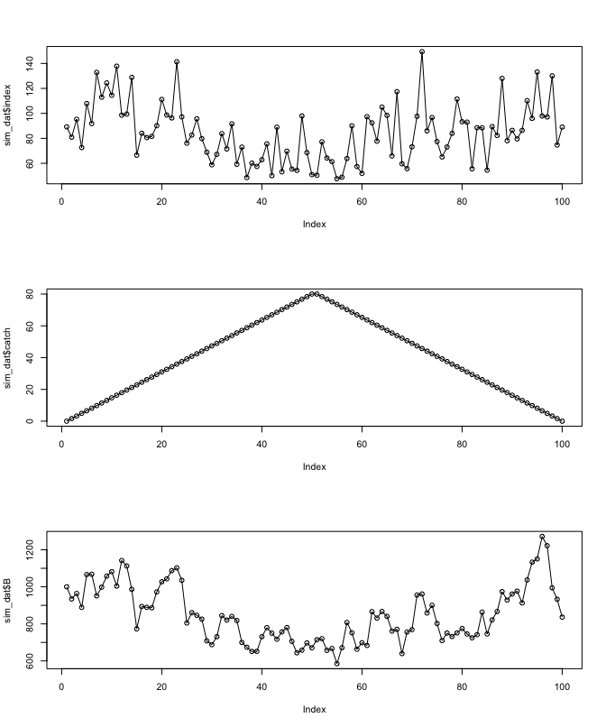
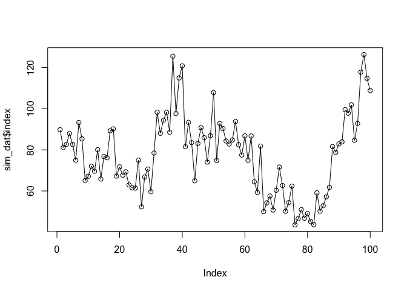
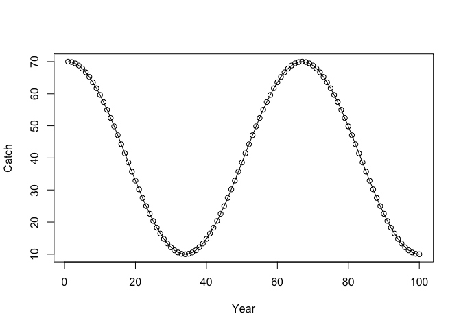
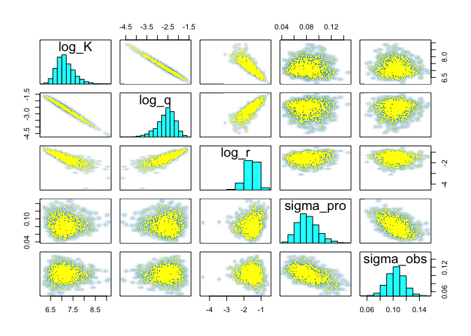
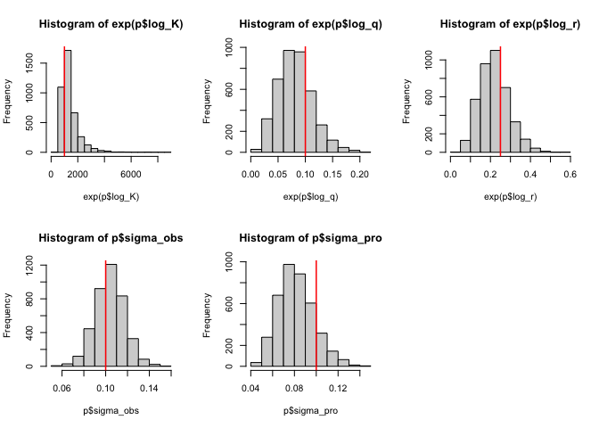
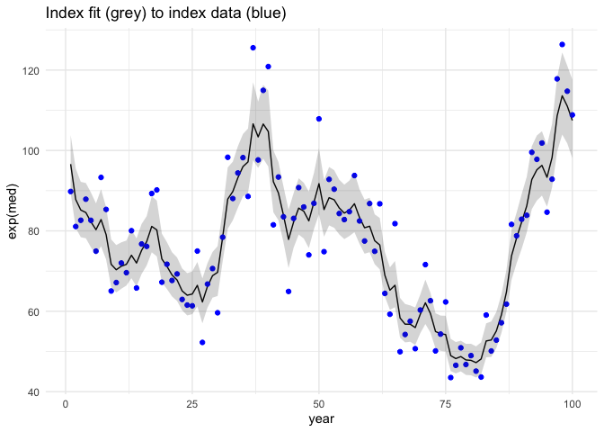
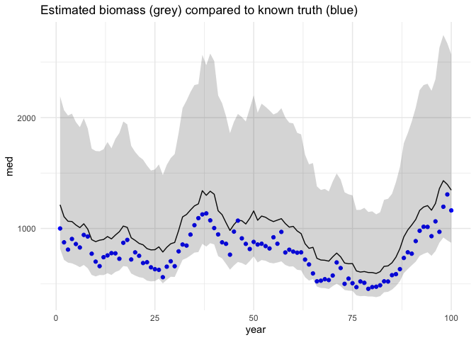

Surplus production
================

Simulate from a Schaefer surplus production model with both process and
observation error:

``` r
set.seed(1)
sim_schaefer <- function(K, r, q, sigma_pro, sigma_obs, N, C) {
  B <- numeric(N)
  U <- numeric(N)
  B[1] <- K
  U[1] <- q * B[1]
  for (i in 2:N) {
    B[i] <- B[i - 1] + r * B[i - 1] * (1 - (B[i - 1] / K)) - C[i - 1]
    B[i] <- B[i] * exp(rnorm(1, -(sigma_pro^2) / 2, sigma_pro)) # add process error
    if (B[i] <= 0) B[i] <- 0.01
    U[i] <- q * B[i]
  }
  index <- exp(log(U) + rnorm(N, -(sigma_obs^2) / 2, sigma_obs)) # add observation error
  list(index = index, catch = C, B = B)
}

catches <- c(seq(0, 80, length.out = 50), seq(80, 0, length.out = 50))
sim_dat <- sim_schaefer(K = 1000, r = 0.3, q = 0.1, sigma_pro = 0.1, sigma_obs = 0.2, 
  N = length(catches), C = catches)
par(mfrow = c(3, 1))
plot(sim_dat$index, type = "o")
plot(sim_dat$catch, type = "o")
plot(sim_dat$B, type = "o")
```

<!-- -->

``` txt
data {
  int<lower=1> N;
  vector[N] C;
  vector[N] log_Uobs;
  real<lower=0> init_depletion;
  real log_K_mean;
  real log_q_mean;
  real log_r_mean;
  real log_K_sd;
  real log_q_sd;
  real log_r_sd;
}
parameters {
  real log_K;
  real<lower=0> sigma;
  real log_q;
  real log_r;
}
transformed parameters {
  vector[N] B;
  vector[N] log_U;
  real K;
  real r;

  K = exp(log_K);
  r = exp(log_r);

  B[1] = init_depletion * K;
  for (i in 2:N) {
    B[i] = B[i - 1] + r * B[i - 1] * (1 - (B[i - 1] / K)) - C[i - 1];
    if (B[i] < 0.001) B[i] = 0.001;
  }
  log_U = log_q + log(B);
}
model {
  sigma ~ normal(0, 1);
  log_K ~ normal(log_K_mean, log_K_sd);
  log_q ~ normal(log_q_mean, log_q_sd);
  log_r ~ normal(log_r_mean, log_r_sd);
  log_Uobs ~ normal(log_U, sigma);
}
```

``` r
library(cmdstanr)

catches <- sin(1.5 * pi * seq(-1, 1, length.out = 100)) * 30 + 40
plot(catches)
```

<!-- -->

``` r
K <- 1000
r <- 0.25
q <- 0.1
sigma_pro <- 0.1
sigma_obs <- 0.1

set.seed(123)
sim_dat <- sim_schaefer(K = K, r = r, q = q, sigma_pro = sigma_pro, sigma_obs = sigma_obs,
  N = length(catches), C = catches)
par(mfrow = c(1, 1))
plot(sim_dat$index, type = "o")
```

<!-- -->

``` r
par(mfrow = c(1, 1))
plot(sim_dat$catch, type = "o", ylab = "Catch", xlab = "Year")

dat <- list(
  C = sim_dat$catch,
  log_Uobs = log(sim_dat$index),
  init_depletion = 1,
  log_K_mean = log(K),
  log_q_mean = log(q),
  log_r_mean = log(r),
  log_K_sd = 2,
  log_q_sd = 1,
  log_r_sd = 1,
  N = length(sim_dat$catch)
)

init <- lapply(seq_len(4), function(i) {
  list(
    log_K = rnorm(1, log(K), 0.2),
    sigma_obs = rlnorm(1, log(sigma_pro), 0.05),
    sigma_pro = rlnorm(1, log(sigma_obs), 0.05),
    log_q = rnorm(1, log(q), 0.2), log_r = rnorm(1, log(r), 0.2),
    eps_raw = rep(0, length(catches))
  )
})

mod <- cmdstan_model("schaefer_ss_log.stan")
fit <- mod$sample(
  data = dat, init = init, parallel_chains = 4L,
  iter_sampling = 1000L, iter_warmup = 1000L, chains = 4L, seed = 123,
  adapt_delta = 0.9999, max_treedepth = 13L
)
```

<!-- -->

    #> Running MCMC with 4 parallel chains...
    #> 
    #> Chain 1 Iteration:    1 / 2000 [  0%]  (Warmup) 
    #> Chain 2 Iteration:    1 / 2000 [  0%]  (Warmup) 
    #> Chain 3 Iteration:    1 / 2000 [  0%]  (Warmup) 
    #> Chain 4 Iteration:    1 / 2000 [  0%]  (Warmup) 
    #> Chain 1 Iteration:  100 / 2000 [  5%]  (Warmup) 
    #> Chain 2 Iteration:  100 / 2000 [  5%]  (Warmup) 
    #> Chain 1 Iteration:  200 / 2000 [ 10%]  (Warmup) 
    #> Chain 3 Iteration:  100 / 2000 [  5%]  (Warmup) 
    #> Chain 1 Iteration:  300 / 2000 [ 15%]  (Warmup) 
    #> Chain 2 Iteration:  200 / 2000 [ 10%]  (Warmup) 
    #> Chain 1 Iteration:  400 / 2000 [ 20%]  (Warmup) 
    #> Chain 4 Iteration:  100 / 2000 [  5%]  (Warmup) 
    #> Chain 1 Iteration:  500 / 2000 [ 25%]  (Warmup) 
    #> Chain 2 Iteration:  300 / 2000 [ 15%]  (Warmup) 
    #> Chain 1 Iteration:  600 / 2000 [ 30%]  (Warmup) 
    #> Chain 3 Iteration:  200 / 2000 [ 10%]  (Warmup) 
    #> Chain 4 Iteration:  200 / 2000 [ 10%]  (Warmup) 
    #> Chain 2 Iteration:  400 / 2000 [ 20%]  (Warmup) 
    #> Chain 1 Iteration:  700 / 2000 [ 35%]  (Warmup) 
    #> Chain 4 Iteration:  300 / 2000 [ 15%]  (Warmup) 
    #> Chain 1 Iteration:  800 / 2000 [ 40%]  (Warmup) 
    #> Chain 2 Iteration:  500 / 2000 [ 25%]  (Warmup) 
    #> Chain 4 Iteration:  400 / 2000 [ 20%]  (Warmup) 
    #> Chain 3 Iteration:  300 / 2000 [ 15%]  (Warmup) 
    #> Chain 1 Iteration:  900 / 2000 [ 45%]  (Warmup) 
    #> Chain 2 Iteration:  600 / 2000 [ 30%]  (Warmup) 
    #> Chain 3 Iteration:  400 / 2000 [ 20%]  (Warmup) 
    #> Chain 4 Iteration:  500 / 2000 [ 25%]  (Warmup) 
    #> Chain 2 Iteration:  700 / 2000 [ 35%]  (Warmup) 
    #> Chain 4 Iteration:  600 / 2000 [ 30%]  (Warmup) 
    #> Chain 1 Iteration: 1000 / 2000 [ 50%]  (Warmup) 
    #> Chain 1 Iteration: 1001 / 2000 [ 50%]  (Sampling) 
    #> Chain 2 Iteration:  800 / 2000 [ 40%]  (Warmup) 
    #> Chain 4 Iteration:  700 / 2000 [ 35%]  (Warmup) 
    #> Chain 2 Iteration:  900 / 2000 [ 45%]  (Warmup) 
    #> Chain 3 Iteration:  500 / 2000 [ 25%]  (Warmup) 
    #> Chain 4 Iteration:  800 / 2000 [ 40%]  (Warmup) 
    #> Chain 1 Iteration: 1100 / 2000 [ 55%]  (Sampling) 
    #> Chain 2 Iteration: 1000 / 2000 [ 50%]  (Warmup) 
    #> Chain 2 Iteration: 1001 / 2000 [ 50%]  (Sampling) 
    #> Chain 4 Iteration:  900 / 2000 [ 45%]  (Warmup) 
    #> Chain 3 Iteration:  600 / 2000 [ 30%]  (Warmup) 
    #> Chain 1 Iteration: 1200 / 2000 [ 60%]  (Sampling) 
    #> Chain 3 Iteration:  700 / 2000 [ 35%]  (Warmup) 
    #> Chain 2 Iteration: 1100 / 2000 [ 55%]  (Sampling) 
    #> Chain 3 Iteration:  800 / 2000 [ 40%]  (Warmup) 
    #> Chain 4 Iteration: 1000 / 2000 [ 50%]  (Warmup) 
    #> Chain 4 Iteration: 1001 / 2000 [ 50%]  (Sampling) 
    #> Chain 1 Iteration: 1300 / 2000 [ 65%]  (Sampling) 
    #> Chain 2 Iteration: 1200 / 2000 [ 60%]  (Sampling) 
    #> Chain 3 Iteration:  900 / 2000 [ 45%]  (Warmup) 
    #> Chain 2 Iteration: 1300 / 2000 [ 65%]  (Sampling) 
    #> Chain 1 Iteration: 1400 / 2000 [ 70%]  (Sampling) 
    #> Chain 3 Iteration: 1000 / 2000 [ 50%]  (Warmup) 
    #> Chain 3 Iteration: 1001 / 2000 [ 50%]  (Sampling) 
    #> Chain 4 Iteration: 1100 / 2000 [ 55%]  (Sampling) 
    #> Chain 2 Iteration: 1400 / 2000 [ 70%]  (Sampling) 
    #> Chain 1 Iteration: 1500 / 2000 [ 75%]  (Sampling) 
    #> Chain 3 Iteration: 1100 / 2000 [ 55%]  (Sampling) 
    #> Chain 2 Iteration: 1500 / 2000 [ 75%]  (Sampling) 
    #> Chain 1 Iteration: 1600 / 2000 [ 80%]  (Sampling) 
    #> Chain 3 Iteration: 1200 / 2000 [ 60%]  (Sampling) 
    #> Chain 4 Iteration: 1200 / 2000 [ 60%]  (Sampling) 
    #> Chain 2 Iteration: 1600 / 2000 [ 80%]  (Sampling) 
    #> Chain 1 Iteration: 1700 / 2000 [ 85%]  (Sampling) 
    #> Chain 2 Iteration: 1700 / 2000 [ 85%]  (Sampling) 
    #> Chain 3 Iteration: 1300 / 2000 [ 65%]  (Sampling) 
    #> Chain 4 Iteration: 1300 / 2000 [ 65%]  (Sampling) 
    #> Chain 1 Iteration: 1800 / 2000 [ 90%]  (Sampling) 
    #> Chain 2 Iteration: 1800 / 2000 [ 90%]  (Sampling) 
    #> Chain 3 Iteration: 1400 / 2000 [ 70%]  (Sampling) 
    #> Chain 1 Iteration: 1900 / 2000 [ 95%]  (Sampling) 
    #> Chain 2 Iteration: 1900 / 2000 [ 95%]  (Sampling) 
    #> Chain 3 Iteration: 1500 / 2000 [ 75%]  (Sampling) 
    #> Chain 4 Iteration: 1400 / 2000 [ 70%]  (Sampling) 
    #> Chain 2 Iteration: 2000 / 2000 [100%]  (Sampling) 
    #> Chain 2 finished in 39.2 seconds.
    #> Chain 1 Iteration: 2000 / 2000 [100%]  (Sampling) 
    #> Chain 1 finished in 39.5 seconds.
    #> Chain 3 Iteration: 1600 / 2000 [ 80%]  (Sampling) 
    #> Chain 3 Iteration: 1700 / 2000 [ 85%]  (Sampling) 
    #> Chain 4 Iteration: 1500 / 2000 [ 75%]  (Sampling) 
    #> Chain 3 Iteration: 1800 / 2000 [ 90%]  (Sampling) 
    #> Chain 4 Iteration: 1600 / 2000 [ 80%]  (Sampling) 
    #> Chain 3 Iteration: 1900 / 2000 [ 95%]  (Sampling) 
    #> Chain 3 Iteration: 2000 / 2000 [100%]  (Sampling) 
    #> Chain 3 finished in 50.1 seconds.
    #> Chain 4 Iteration: 1700 / 2000 [ 85%]  (Sampling) 
    #> Chain 4 Iteration: 1800 / 2000 [ 90%]  (Sampling) 
    #> Chain 4 Iteration: 1900 / 2000 [ 95%]  (Sampling) 
    #> Chain 4 Iteration: 2000 / 2000 [100%]  (Sampling) 
    #> Chain 4 finished in 64.4 seconds.
    #> 
    #> All 4 chains finished successfully.
    #> Mean chain execution time: 48.3 seconds.
    #> Total execution time: 64.5 seconds.
    fit$cmdstan_diagnose()
    #> Processing csv files: /var/folders/x3/9z_nkkfs3nsdgf0bvvj50t1h0000gn/T/Rtmp7YBXsV/schaefer_ss_log-202203011812-1-0f75bf.csv, /var/folders/x3/9z_nkkfs3nsdgf0bvvj50t1h0000gn/T/Rtmp7YBXsV/schaefer_ss_log-202203011812-2-0f75bf.csv, /var/folders/x3/9z_nkkfs3nsdgf0bvvj50t1h0000gn/T/Rtmp7YBXsV/schaefer_ss_log-202203011812-3-0f75bf.csv, /var/folders/x3/9z_nkkfs3nsdgf0bvvj50t1h0000gn/T/Rtmp7YBXsV/schaefer_ss_log-202203011812-4-0f75bf.csv
    #> 
    #> Checking sampler transitions treedepth.
    #> Treedepth satisfactory for all transitions.
    #> 
    #> Checking sampler transitions for divergences.
    #> No divergent transitions found.
    #> 
    #> Checking E-BFMI - sampler transitions HMC potential energy.
    #> E-BFMI satisfactory.
    #> 
    #> Effective sample size satisfactory.
    #> 
    #> Split R-hat values satisfactory all parameters.
    #> 
    #> Processing complete, no problems detected.
    stanfit <- rstan::read_stan_csv(fit$output_files())

``` r
print(stanfit, pars = c("log_K", "log_q", "log_r", "sigma_pro", "sigma_obs"))
#> Inference for Stan model: schaefer_ss_log-202203011812-1-0f75bf.
#> 4 chains, each with iter=2000; warmup=1000; thin=1; 
#> post-warmup draws per chain=1000, total post-warmup draws=4000.
#> 
#>            mean se_mean   sd  2.5%   25%   50%   75% 97.5% n_eff Rhat
#> log_K      7.16    0.01 0.40  6.52  6.88  7.10  7.38  8.08  1604 1.00
#> log_q     -2.59    0.01 0.43 -3.60 -2.83 -2.53 -2.29 -1.89  1613 1.00
#> log_r     -1.58    0.01 0.35 -2.35 -1.78 -1.55 -1.34 -0.98  1709 1.00
#> sigma_pro  0.08    0.00 0.02  0.05  0.07  0.08  0.09  0.12   643 1.01
#> sigma_obs  0.10    0.00 0.01  0.08  0.09  0.10  0.11  0.13   768 1.00
#> 
#> Samples were drawn using NUTS(diag_e) at Tue Mar 01 18:13:34 2022.
#> For each parameter, n_eff is a crude measure of effective sample size,
#> and Rhat is the potential scale reduction factor on split chains (at 
#> convergence, Rhat=1).
pairs(stanfit, pars = c("log_K", "log_q", "log_r", "sigma_pro", "sigma_obs"))
```

<!-- -->

``` r
p <- rstan::extract(stanfit)
par(mfrow = c(2, 3))
hist(exp(p$log_K));abline(v = K, col = "red", lwd = 1.5)
hist(exp(p$log_q));abline(v = q, col = "red", lwd = 1.5)
hist(exp(p$log_r));abline(v = r, col = "red", lwd = 1.5)
hist(p$sigma_obs);abline(v = sigma_obs, col = "red", lwd = 1.5)
hist(p$sigma_pro);abline(v = sigma_pro, col = "red", lwd = 1.5)
```

<!-- -->

``` r
library(ggplot2)
library(dplyr)
med <- apply(p$log_U, 2, median)
upr <- apply(p$log_U, 2, quantile, probs = 0.9)
lwr <- apply(p$log_U, 2, quantile, probs = 0.1)
data.frame(year = 1:100, med, lwr, upr, index = sim_dat$index) %>%
  ggplot(aes(year, exp(med))) + geom_line() +
  geom_point(aes(y = index), col = "blue") +
  geom_ribbon(aes(ymin = exp(lwr), ymax = exp(upr)), alpha = 0.2) +
  theme_minimal() + ggtitle("Index fit (grey) to index data (blue)")
```

<!-- -->

``` r
med <- apply(p$B, 2, median)
upr <- apply(p$B, 2, quantile, probs = 0.9)
lwr <- apply(p$B, 2, quantile, probs = 0.1)
data.frame(year = 1:100, med, lwr, upr, true_B = sim_dat$B, index = sim_dat$index) %>%
  ggplot(aes(year, med)) + geom_line() +
  geom_point(aes(y = true_B), col = "blue") +
  geom_ribbon(aes(ymin = lwr, ymax = upr), alpha = 0.2) +
  theme_minimal() +
  ggtitle("Estimated biomass (grey) compared to known truth (blue)")
```

<!-- -->
