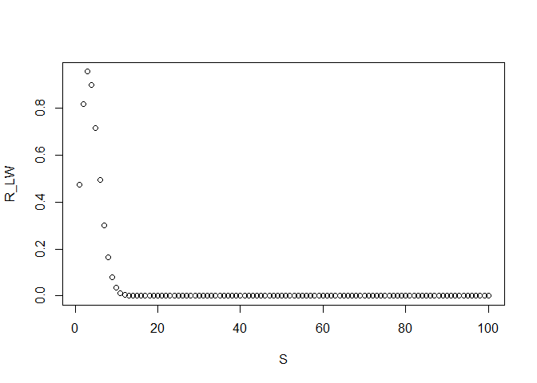
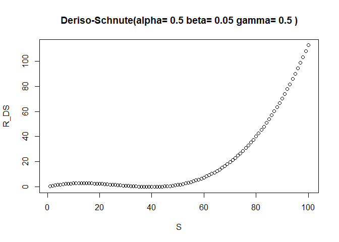
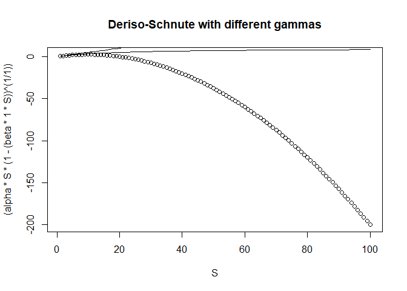
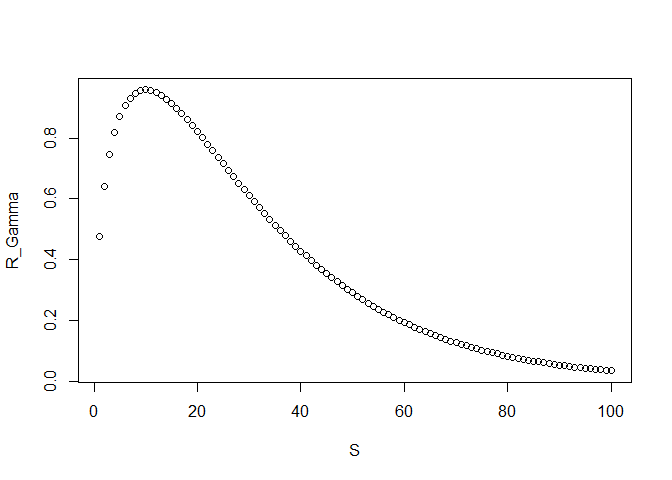
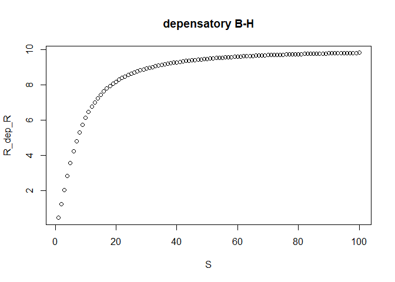
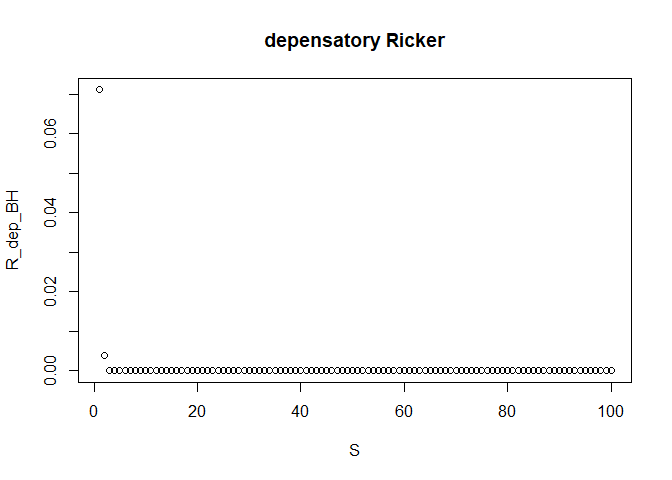

Recruitment exploraiton
================

## Beverton-Holt

Expnded (eq 3.6) where `a` and `b` are density dependent, and
independent additive effects on mortality, `Z`, and `T` is age at
recruitment.

``` r
S <- 1:100 #vector of spawners
T <- 4 #age @ recruitment
f <- 10  #avg net fecundity
a1 <- 0.5 #DI effect on mortality
b1 <- 0.1 #DD effect on mortality

R_L_BH <- S/((exp(a1*T)/f) + (b1/a1)*(exp(a1*T) - 1)*S)

plot(R_L_BH~S)
```

<!-- -->

We can get the more normal parameters, alpha and beta, with some math.  
- What do a1 and b1 *really mean*? How would one choose a reasonable
starting value for them for a population? Can you empirically estimate
these? Or they more abstract?

``` r
alpha <- f*exp(-a1*T)
beta <- f*b1*(1-exp(-a1*T))/a1
```

Then plug these values into the Beverton-Holt and get the same figure as
earlier.

``` r
R_BH <- (alpha*S)/(1+beta*S)

plot(R_BH~S)
```

<!-- -->

### Ricker

Now we do the same as above by formulating the Ricker (eq. 3.8) with
additive DI and DD effects on mortality. **I’m going to try keeping the
a1 and b1 as above, but I’m not sure this is proper**  
- It’s probably not proper because they use *a2* and *b2* (eq 3.7);
these still mean the same thing but they need to be different numbers?

``` r
#S <- seq(0, 10, by = 0.1) # helper to toggle S around
b1 <- 0.01 #overwrite b to make a nice fig 
R_L_R <- f*exp(-a1*T)*S*exp(-b1*T*S)

plot(R_L_R ~ S) #my code & math is right I just picked weird values for a and B I think... 
```

<!-- -->

If everything is right I *should be* able to write the Ricker with the
alpha and betas I calculated earlier?  
- No. `a2` and `b2` behave differently in the equation. See top line of
eq 3.8 and compare with eq 3.6 while looking at in-text math for `a` and
`b`. - Is there any utility in isolating alpha and beta to find values
for `a2` and `b2` like we did above for the Beverton-Holt?

``` r
R_R <- alpha*S*exp(-beta*S)

plot(R_R ~ S, main = "bad Ricker!") #nope! - this should match the previous fig. 
```

<!-- -->

We’ll go ahead and pick nice parameters to use later, and plot a second
Ricker.

``` r
alpha <- 0.5
  
beta <- 0.05
  
R_R2 <- alpha*S*exp(-beta*S)

plot(R_R2~S, main = "better Ricker")
```

<!-- -->

### Ludwig-Walters model

where the DD mortality term is a power function of the Spawning stock  
If the 3rd parameter, `gamma`, = 1 it’s a Ricker. They suggest setting
`gamma` = 2  
- Is this parameter fit or fixed? Seems like it could be hard to
estimate.

``` r
gamma <- 2
R_LW <- alpha*S*exp(-beta*S^gamma)

plot(R_LW~S)
```

<!-- -->

### Environmental variation

Other *normally distributed* environmental effects also influence
recruitment, and can be incorporated into the exponent of a Ricker (eq
3.10), or in a linear Ricker in the form of multiple regression. The
point is that we add stochastic variation to the Ricker via lognormally
distributed error, first by generating random, normal noise, then
exponentiating it in the Ricker.

``` r
proc_error <- rnorm(length(S), sd = 0.5)

R_stoch <- alpha*S*exp(-beta*S)*exp(proc_error)

plot(R_stoch ~ S)
lines(R_R2 ~ S)
```

<!-- -->
### Cushing  
Two parameter model not used much in practice. *Why show the other
parameterizaiton here?*

``` r
gamma <- 0.5
R_cush <- alpha*S^gamma

plot(R_cush ~S, main = paste("cushing where gamma =", gamma))
```

<!-- -->

``` r
plot((alpha*S^1)~S, main = "cushing with different gammas")
lines((alpha*S^0.8)~S)
lines((alpha*S^1.2)~S)
```

<!-- -->

### Deriso-Schnute

Three parameter model based on 2 species considering predator-prey.
Added comments for Schnute’s definitions of parms.  
When `gamma <- -1` you have a Beverton-Holt, a Ricker as `gamma`
approaches 0. As `gamma` approaches `Inf` recruitment becomes
proportional to the spawning stock.  
*Skipping derivation steps*

``` r
#toggle as you please
alpha <- 0.5 #the productivity parameter
beta <- 0.05 #the optimality parameter
gamma <- 0.5 #recruitment limitation/skewness parameter

R_DS <- alpha*S*(1-(beta*gamma*S))^(1/gamma)


plot(R_DS~S, main = paste("Deriso-Schnute(alpha=", alpha, "beta=", beta, "gamma=", gamma, ")"))
```

<!-- -->

#### Figure 3.5

-   Hmmm, need to pick better numbers?

``` r
plot((alpha*S*(1-(beta*1*S))^(1/1))~S, main = "Deriso-Schnute with different gammas")
lines((alpha*S*(1-(beta*-1*S))^(1/-1))~S)
lines((alpha*S*(1-(beta*0*S))^(1/0))~S)
```

<!-- -->

### Shepard

When `gamma <- 1` you have a Beverton-Holt, when `gamma > 1` a dome
shaped SR curve, and when `gamma < 1` a curve that increases
indefinitely like the Cushing.  
Derived by making considerations between recruitment and growth, where
DD is inversely proportional to resultant growth, and growth is a DD
funciton of the number of eggs.

``` r
R_Shep <- alpha*S/(1+(beta*S^gamma))

plot(R_Shep~S, )
```

<!-- -->

### Gamma

*unnormalized* (wtf?) gamma function. Similar flexibility to the
Deriso_Schnute, but the asymptotic behavior of the Beverton-Holt not
completely captured. When `gamma . 0` it’s dome shaped like a Ricker,
and is a Ricker when `gamma <- 1`. It’s a Cushing when `beta <- 0`, and
behaves like a Beverton-Holt as `gamma` approaches 0. When `gamma <= 0`
it isn’t a proper SR model because it doesn’t go through the origin
(Reish et al, 1985).  
- *again* why show those 2 parameterizations like the Cushing in eq
3.22?

``` r
R_Gamma <- (alpha*S^gamma)*exp(-beta*S)

plot(R_Gamma~S)
```

<!-- -->

## Depensatory models

So far only the Gamma SR model has any depensation in it. We can modify
the B-H and Ricker to include a term for depensation.  
Note that when `gamma <- 1` The models are in their original form. When
`gamma > 1` populations show depensation.

``` r
gamma <- 1.5 #overwrite gamma to be depensatory 

R_dep_R <- alpha*S^gamma/(1+(beta*S^gamma))

plot(R_dep_R ~S, main = "depensatory B-H")
```

<!-- -->

``` r
delta <- 2
R_dep_BH <- alpha*S*exp((beta*S) - (delta*S^gamma))

plot(R_dep_BH~S, main = "depensatory Ricker")
```

<!-- -->

## Denensatory recruitment exercise

It’s really hard to see the depensation in these, so we’ll try another
exercise leftover from a class Chris Cahill and John Post taught me
(Dylan) back in 2018 or something…  
This Beverton-Holt with depensation, `delta`, follows a form from [Myers
et al,
1995](https://www.science.org/doi/epdf/10.1126/science.269.5227.1106),
but is the same as eq. 3.27 in Q&D.  
We’ll set the parameters here. Some are log-transformed to ease in
estimation later.

``` r
S <- 0:1000 #spawners
alpha <- .07 
K <- log(7500) #K is density dependent effect 
delta <- 1.7 #depensatory term 
r_sd <- log(20) #sd for sims

MinStock <- c(0, 150, 300, 600) #how far down are you allowed to fish the stock? 
```

Now we’ll add some error.

``` r
R_dep_BH <- (alpha*S^delta)/(1+(S^delta/(exp(K)))) #deterministic 

#OK, now to simulate some data
eps_add <- rnorm(100, sd=exp(r_sd)) #additive error 
SSamples <- sample(S, 100, replace=TRUE) #randomly select 100 values of S
R_Noisy <- (alpha*SSamples^delta)/(1+(SSamples^delta/(exp(K))))+eps_add 
```

Now we can toggle the `MinStock` around (by changing `x` in
`MinStock[x]`) to be however low a manager would allow the stock to get
before seeing the shape of the SR curve. Can expand this by
adding/removing values to the `MinStock` vector as well.  
- I wonder if it makes sense to add more error to the truncated
(i.e. observed) data…?

``` r
TruncSSamples <- sample(MinStock[2]:1000, 100, replace=TRUE)
R_TruncNoisy <- (alpha*TruncSSamples^delta)/(1+(TruncSSamples^delta/(exp(K))))+eps_add
```

Probably makes sense to look at the fake data at this point! Open
circles are what the deterministic model was fit to, and the closed
circles are what we’ll try to estimate.

``` r
plot(R_dep_BH~S, type="l",  
     main="True data (open), replacement line(dashed), and simulated data (closed)", 
     ylim=c(0,650))
points(R_Noisy~SSamples)
points(R_TruncNoisy~TruncSSamples, pch=16)
lines(S~S,lty=3)#1:1 replacement line
```

<!-- -->
- not much depensation on that fig… how could we increase it in a sim?

Now we’ll build a likelihood.

``` r
parms <- c(alpha, K, r_sd, delta) 

getNegLogLike <- function(parms){
  alpha  <- parms[1] #unpack parms
  K <- exp(parms[2])
  r_sd  <- exp(parms[3]) 
  if(length(parms>3)){
      delta  <- parms[4]
  } else{
    delta <- 1
  }
  predicted <- (alpha*S^delta)/(1+(S^delta/K)) 
  NegLogLike <- -sum(log(dnorm(observed, predicted, sd=r_sd))) #calculate NLL
  return(NegLogLike)
}
```

Now we’ll simulate and estimate parms for the 4 levels of acceptable
harvest.  
- something’s breaking  
- am I fitting this right or is it still trying to estimate `delta`? I
want to make sure `optim` isn’t trying to guess `delta`

``` r
NSim <- 1000
NSamps <- 100
#build empty array(rows=sims, cols=parms, pages=fits, books=stock levels)
answers <- array(NA, dim=c(NSim, 4, 2, 4)) 

#values to be estimated, just going to use true values for ease of fit 
alpha_e <- alpha
K_e <- K   
delta_e <- delta 
r_sd_e <- r_sd

dep_parms  <- c(alpha_e, K_e, r_sd_e, delta_e) 
classic_parms  <- c(alpha_e, K_e, r_sd_e)

if(FALSE){ #turning this off for now because it's busted. 

#loop some sims 
for(k in length(MinStock)){ #loop min stock sizes
  for(j in 1:2){ #loop methods
    if(j==1){parms<-dep_parms} 
    if(j==2){parms<-classic_parms
    delta <- 1}
    for(i in 1:NSim){
      #make vectors of observed and predicted
      SimStock <- sample(MinStock[k]:1000, NSamps, replace=TRUE)

      predicted <- (alpha*SimStock^delta)/(1+(SimStock^delta/exp(K)))
      observed  <- predicted + rnorm(length(predicted), mean=0, exp(r_sd)) 
  
      #fit it
      fit <- optim(parms, getNegLogLike, method="Nelder-Mead", hessian=T)
  
  #print results and account for uneven # of parms
  if(length(fit$par)==dim(answers)[2]){answers[i, ,j,k] <- fit$par} 
  else {answers[i, 1:3 ,j,k] <- fit$par} 
    }
  }
}

str(answers)
colnames(answers) <- c("alpha", "log_K", "log_r_sd", "delta") #some names for parms
head(answers[,,1,1])#checking it's all populated

} #close chunk turning it off. 
```
