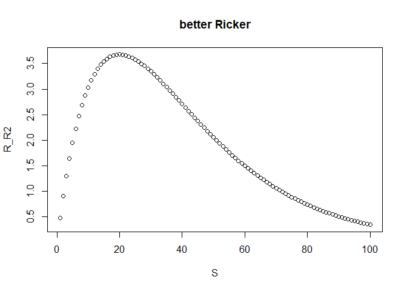

Recruitment exploraiton
================

## Beverton-Holt

Expnded (eq 3.6) where `a` and `b` are density dependent, and
independent additive effects on mortality, `Z`, and `T` is age at
recruitment.

``` r
S <- 1:100 #vector of spawners
T <- 4 #age @ recruitment
f <- 10  #avg net fecundity
a1 <- 0.5 #DI effect on mortality
b1 <- 0.1 #DD effect on mortality

R_L_BH <- S/((exp(a1*T)/f) + (b1/a1)*(exp(a1*T) - 1)*S)

plot(R_L_BH~S)
```

<!-- -->

We can get the more normal parameters, alpha and beta, with some math.  
- What do a1 and b1 *really mean*? How would one choose a reasonable
starting value for them for a population? Can you empirically estimate
these? Or they more abstract?

``` r
alpha <- f*exp(-a1*T)
beta <- f*b1*(1-exp(-a1*T))/a1
```

Then plug these values into the Beverton-Holt and get the same figure as
earlier.

``` r
R_BH <- (alpha*S)/(1+beta*S)

plot(R_BH~S)
```

<!-- -->

### Ricker

Now we do the same as above by formulating the Ricker (eq. 3.8) with
additive DI and DD effects on mortality. **I’m going to try keeping the
a1 and b1 as above, but I’m not sure this is proper**  
- It’s probably not proper because they use *a2* and *b2* (eq 3.7);
these still mean the same thing but they need to be different numbers?

``` r
#S <- seq(0, 10, by = 0.1) # helper to toggle S around
b1 <- 0.01 #overwrite b to make a nice fig 
R_L_R <- f*exp(-a1*T)*S*exp(-b1*T*S)

plot(R_L_R ~ S) #my code & math is right I just picked weird values for a and B I think... 
```

<!-- -->

If everything is right I *should be* able to write the Ricker with the
alpha and betas I calculated earlier?  
- No. `a2` and `b2` behave differently in the equation. See top line of
eq 3.8 and compare with eq 3.6 while looking at in-text math for `a` and
`b`. - Is there any utility in isolating alpha and beta to find values
for `a2` and `b2` like we did above for the Beverton-Holt?

``` r
R_R <- alpha*S*exp(-beta*S)

plot(R_R ~ S, main = "bad Ricker!") #nope! - this should match the previous fig. 
```

<!-- -->

We’ll go ahead and pick nice parameters to use later, and plot a second
Ricker.

``` r
alpha <- 0.5
  
beta <- 0.05
  
R_R2 <- alpha*S*exp(-beta*S)

plot(R_R2~S, main = "better Ricker")
```

<!-- -->

### Ludwig-Walters model

where the DD mortality term is a power function of the Spawning stock  
If the 3rd parameter, `gamma`, = 1 it’s a Ricker. They suggest setting
`gamma` = 2  
- Is this parameter fit or fixed? Seems like it could be hard to
estimate.

``` r
gamma <- 2
R_LW <- alpha*S*exp(-beta*S^gamma)

plot(R_LW~S)
```

<!-- -->

### Environmental variation

Other *normally distributed* environmental effects also influence
recruitment, and can be incorporated into the exponent of a Ricker (eq
3.10), or in a linear Ricker in the form of multiple regression. The
point is that we add stochastic variation to the Ricker via lognormally
distributed error, first by generating random, normal noise, then
exponentiating it in the Ricker.

``` r
proc_error <- rnorm(length(S), sd = 0.5)

R_stoch <- alpha*S*exp(-beta*S)*exp(proc_error)

plot(R_stoch ~ S)
lines(R_R2 ~ S)
```

<!-- -->
### Cushing  
Two parameter model not used much in practice. *Why show the other
parameterizaiton here?*

``` r
gamma <- 0.5
R_cush <- alpha*S^gamma

plot(R_cush ~S, main = paste("cushing where gamma =", gamma))
```

<!-- -->

``` r
plot((alpha*S^1)~S, main = "cushing with different gammas")
lines((alpha*S^0.8)~S)
lines((alpha*S^1.2)~S)
```

<!-- -->

### Deriso-Schnute

Three parameter model based on 2 species considering predator-prey.
Added comments for Schnute’s definitions of parms.  
When `gamma <- -1` you have a Beverton-Holt, a Ricker as `gamma`
approaches 0. As `gamma` approaches `Inf` recruitment becomes
proportional to the spawning stock.  
*Skipping derivation steps*

``` r
#toggle as you please
alpha <- 0.5 #the productivity parameter
beta <- 0.05 #the optimality parameter
gamma <- 0.5 #recruitment limitation/skewness parameter

R_DS <- alpha*S*(1-(beta*gamma*S))^(1/gamma)


plot(R_DS~S, main = paste("Deriso-Schnute(alpha=", alpha, "beta=", beta, "gamma=", gamma, ")"))
```

<!-- -->

#### Figure 3.5

-   Hmmm, need to pick better numbers?

``` r
plot((alpha*S*(1-(beta*1*S))^(1/1))~S, main = "cushing with different gammas")
lines((alpha*S*(1-(beta*-1*S))^(1/-1))~S)
lines((alpha*S*(1-(beta*0*S))^(1/0))~S)
```

<!-- -->

### Shepard

When `gamma <- 1` you have a Beverton-Holt, when `gamma > 1` a dome
shaped SR curve, and when `gamma < 1` a curve that increases
indefinitely like the Cushing.
